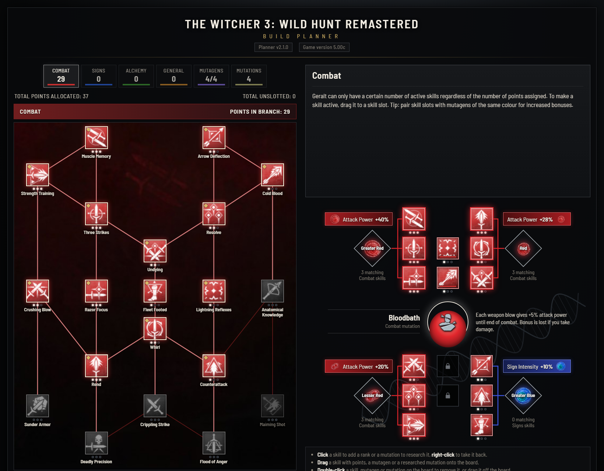

# Witcher 3 Remastered Build Planner

Plan a character for **The Witcher 3: Wild Hunt Remastered** before you spend a single point in the game.
The Remastered release reworked the skill trees, renamed skills, moved them and added new ones, so the
planners made for earlier versions no longer match what the game shows. This one follows the game as it
is now, version 5.00c, from the skill trees to the mutations, the potions and the witcher gear, and it fits
a whole build into one link you can send to a friend or keep for later.

**[Open the planner](https://nyiriattila88.github.io/witcher3-build-planner/)**. It runs in the browser on
a computer or a phone, with nothing to install.

## What you can do

- **Spend points in the four skill trees.** Combat, Signs, Alchemy and General look the way the game draws
  them, with its links, icons and tooltip texts and three ranks per skill. A skill opens once a linked
  skill before it has a point, and taking that point back closes the branch behind it.
- **Slot skills and mutagens.** Twelve skill slots sit in four groups, each with a mutagen whose bonus
  grows with every skill of its colour in the group and with Synergy. The board shows which slots count.
- **Research mutations.** Research them in order, slot one in the centre, and fill the four extra skill
  slots around it, which open as you research more and take only the mutation's colours.
- **Plan potions and decoctions.** Pick what is active together and see it against your maximum Toxicity,
  which grows with Acquired Tolerance for the recipes you know, Metabolic Control and Manticore armor. The
  overdose threshold is marked, and as in the game nothing goes over the maximum.
- **Choose witcher gear.** Bear, Cat, Griffin, Wolf, Forgotten Wolf, Manticore and Viper gear in every
  version from basic to grandmaster, mixed freely, with runes and glyphs socket by socket or a runeword or
  glyphword from the Runewright, and the set bonuses of 3 and 6 pieces.
- **See the totals.** The build summary adds up what the slotted skills, the mutagens and the gear give,
  one line per stat.
- **Share a build.** The page address carries the whole build, so copying the link shares it. A short
  build code does the same where a link does not fit.
- **Use it on a phone.** The trees and the board fit the screen, a tap on a board slot lists what can go
  in, and the page can sit on the home screen with its own icon.

## How to use it

| To                                            | With a mouse                                    | On a touch screen     |
| --------------------------------------------- | ----------------------------------------------- | --------------------- |
| Add a rank or research a mutation             | Click                                           | Tap                   |
| Take it back                                  | Right-click                                     | Double tap            |
| Put a skill, mutagen or mutation on the board | Drag it onto a slot, or click the slot and pick | Tap the slot and pick |
| Take it off the board                         | Double-click, or drag it off the board          | Double tap            |

Hover over a skill, a mutation or a piece of gear to see its tooltip. The info panel explains whatever is
under the pointer in full, and the header names the planner version and the game version the data
matches.

## For developers

The planner is React 19 and TypeScript, built with Vite and deployed to GitHub Pages from every tagged
release. How it is put together, from the rule model to the build code format, and how to run it locally is in
[docs/architecture.md](docs/architecture.md). Every version is in the [CHANGELOG](CHANGELOG.md) and on the
[releases page](https://github.com/nyiriattila88/witcher3-build-planner/releases).

## Where the data comes from

- Skill names and per-rank values: LAMBKING's "Complete Skill Tree Reference" posts on r/witcher.
- Tooltip wording: the Fextralife Witcher 3 wiki, checked against Hack the Minotaur's remaster skill tree
  guide.
- Tree layout, links and backdrops: in-game screenshots published by Mobalytics, which also give the icons
  of the skills that are new in the Remastered. The other skill icons: The Witcher Wiki on Fandom.
- Mutations, mutagens and the extra slot rules: the rpg-gaming.com Witcher 3 build planner.
- Mutation discs: cut from an in-game screenshot on the Improved Mutations page on Nexus Mods. Mutagen
  orbs: The Witcher Wiki on Fandom.
- Potions and decoctions, their Toxicity, durations and effects and the Manticore armor: The Witcher Wiki
  on Fandom, with the values since patch 4.0, and the Fextralife Witcher 3 wiki pages edited after 4.0
  where the two disagree. The effect values are written into the in-game descriptions. The overdose
  threshold at half of the maximum: the list of changes of the next-gen update 4.0. The 167 alchemy
  recipes: what players measured with Acquired Tolerance since 4.0 (148 in the base game, 150 with Hearts
  of Stone).
- Witcher gear, set bonuses, runestones, glyphs and the Runewright's runewords and glyphwords: The
  Witcher Wiki on Fandom, with the regular game's values since patch 4.0. The set bonuses come with the
  final, grandmaster version of a school's gear.
- Game version: the Remastered patch notes on thewitcher.com. Patches 5.00b and 5.00c changed no
  skills.

## License

The code is released under the [MIT License](LICENSE). The Witcher 3: Wild Hunt, its names, icons and
artwork belong to CD PROJEKT RED and are not covered by it. This is a fan project, not affiliated with or
endorsed by CD PROJEKT RED. The Barlow Semi Condensed font is bundled through Fontsource under the SIL Open
Font License 1.1.

## Author

Made by Attila Nyiri, [@nyiriattila88](https://github.com/nyiriattila88).
